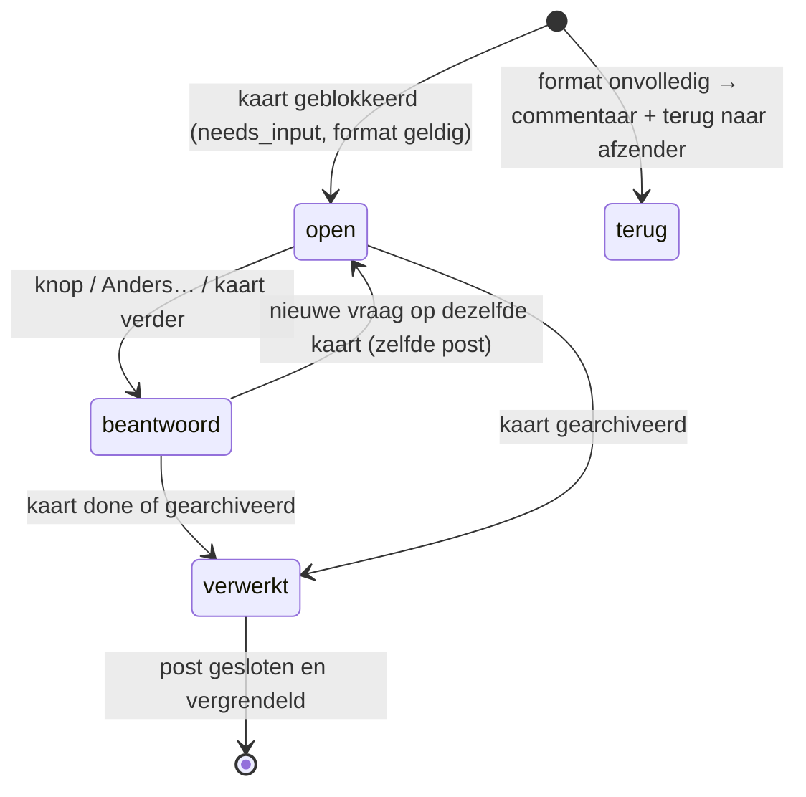
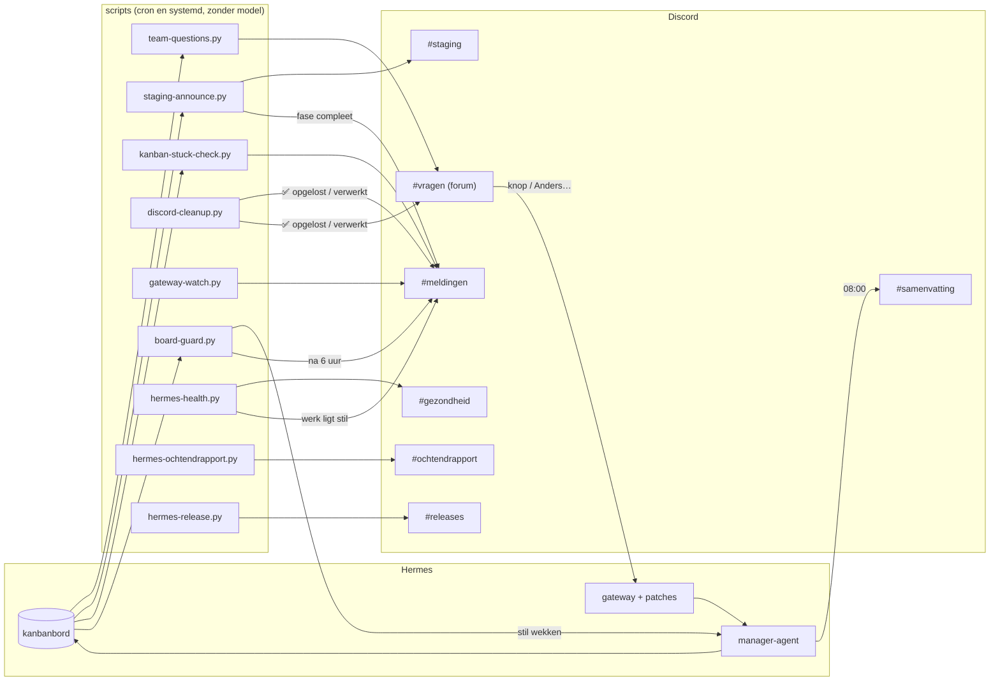

# Hermes Discord Flow

Een vaste Discord-inrichting voor een team van [Hermes](https://github.com/NousResearch/hermes-agent)-agents dat aan projecten werkt op een kanbanbord. Het team stelt jou zijn vragen in een forum, met een knop per optie. Meldingen, staging en een dagelijkse samenvatting krijgen elk een eigen kanaal. Alles draait als kleine scripts op je server, zonder model: alleen de dagelijkse samenvatting gebruikt de manager-agent.

> **Werkt met Hermes 0.21.4 = upstream-tag `v2026.9.21`, plus de patches in [`patches/`](patches/README.md).**
> Zonder de verplichte patches werken de knoppen in #vragen niet. Andere Hermes-versies zijn niet getest.

## Inhoud

- [Wat het doet](#wat-het-doet)
- [Wat je nodig hebt](#wat-je-nodig-hebt)
- [Zelf installeren](#zelf-installeren)
- [Testlijst](#testlijst)
- [Bestanden](#bestanden)
- [Licentie](#licentie)

## Wat het doet

De flow heeft twee lagen. Begin met de **basis**; de **extra's** kun je later aanzetten (`install.sh` zonder `--basis`).

### Basis

| Kanaal | Soort | Melding | Wat staat erin | Door |
|---|---|---|---|---|
| **#vragen** | forum | ping | Eén post per vraag van het team aan jou: de aanbevolen optie bovenaan als groene knop met ⭐, de andere opties als knop, en **✏️ Anders…** (opent een invulveld). Labels: project en **open** → **beantwoord** → **verwerkt**. | `team-questions.py` (elke 2 min) |
| **#meldingen** | tekst | ping | Alleen projectwerk dat stilligt: vastgelopen of mislukte kaarten, "beslissing manager", blok of fase compleet, gateway plat. Is het voorbij, dan wordt het bericht "✅ opgelost". | `kanban-stuck-check.py`, `staging-announce.py`, `gateway-watch.py`, `discord-cleanup.py` |
| **#staging** | tekst | stil | Eén regel per kaart die op staging staat. | `staging-announce.py` (elke 2 min) |
| **#samenvatting** | tekst | stil | De dagelijkse samenvatting (08:00): af, bezig, vast, meting. | Hermes-cron met `daily-summary-data.py` + de manager |
| **#chatlog** | tekst | normaal | Je gesprekken met de manager (het "home channel" van de gateway). Hier staan nooit vragen die jij moet beslissen. | gateway |

**Hoe een vraag loopt:**
1. Een agent heeft een beslissing van je nodig. Hij blokkeert zijn kaart met `needs_input` en een reden in een vast format (opties met voor- en nadelen, één ⭐-advies; zie [`docs/manager-instructies.md`](docs/manager-instructies.md)).
2. Binnen 2 minuten staat de vraag als post in #vragen, met een ping. Een vraag zonder opties, zonder advies of met een serverpad wordt **niet** gepost; de kaart gaat met een commentaar terug naar de afzender.
3. Jij klikt een knop, gebruikt **Anders…**, of typt in de post. Alleen jouw account telt (`owner_id`).
4. De manager zet je antwoord letterlijk op de kaart ("Antwoord van …"), en de kaart gaat verder, of wacht op iets anders met een reden "Wacht op …". Een wachtstand is geen vraag en komt niet in #vragen.
5. Is de kaart klaar, dan krijgt de post het label **verwerkt** en wordt hij gesloten.



### Extra

| Kanaal | Soort | Melding | Wat staat erin | Door |
|---|---|---|---|---|
| **WORKFLOW → #ochtendrapport** | tekst | 1 ping per dag | Gezondheid, de nachtcontrole, wat er zelf is opgelost en de open workflowpunten; op maandag het weekoverzicht van je incidentenlog. | `hermes-ochtendrapport.py` (07:30) |
| **WORKFLOW → #gezondheid** | tekst | stil | Gezondheidsmeldingen die het projectwerk **niet** stilleggen (schijf, geheugen, git, staging, werkmappen …). Wordt "✅ opgelost". Legt een storing het werk wél stil (gateway, dispatcher, database), dan gaat hij naar #meldingen. | `hermes-health.py` (elk half uur) |
| **WORKFLOW → #releases** | tekst | stil | Eén regel per workflow-release, alleen als de controle groen is. | `hermes-release.py --notitie "…"` |
| — | — | — | **Bordbewaking**: zoekt afwijkingen op het bord (vraag zonder post, blokkade zonder reden, kaart zonder project, …) en wekt de manager stil. Staat het er na 6 uur nog, dan één melding in #meldingen. | `board-guard.py` (elk half uur) |
| — | — | — | **Opruiming en groeicontrole**: werkmappen en git-worktrees van afgeronde kaarten gaan weg (eerst gearchiveerd als er iets in staat); de gezondheidscheck meldt als ze te groot worden. | `clean_kanban_workspaces.py`, `werkmap_groei.py` |
| — | — | — | **Status per vraag**: `team-status.py` toont per project de open kaarten met hun reden van nu, en of een vraag "BEANTWOORD, WORDT VERWERKT" is. De manager gebruikt dit voor elk statusoverzicht. | `team-status.py` |

Optioneel: `drain-restart.py` (de gateway veilig herstarten: eerst geen nieuwe kaarten, wachten tot er 0 workers lopen) en `chatlog-rotate.py` (elke nacht een nieuwe #chatlog-sessie met een korte overdracht; `install.sh --met-chatlog`).



Alle namen, teksten, tijden en drempels staan in één config: [`config.example.yaml`](config.example.yaml) (met uitleg per veld). Je eigen versie staat op `~/.hermes/team/flow.yaml` en gaat nooit in git.

## Wat je nodig hebt

- **Hermes 0.21.4** (upstream-tag **`v2026.9.21`**) met een werkend kanbanbord, een manager-profiel (`default`) en de gateway als systemd --user dienst (`hermes-gateway.service`). Op die checkout pas je de patches toe (stap 1 hieronder).
- **Python ≥ 3.11** met **PyYAML** (`apt install python3-yaml` of `pip install pyyaml`), **git**, en **systemd --user** met lingering aan (`loginctl enable-linger $USER`), zodat de timers ook draaien als je niet ingelogd bent.
- **Een Discord-server** waarvan jij eigenaar bent.
- **Een Discord-bot** (Developer Portal → Applications → New Application → Bot):
  - **Privileged Gateway Intents:** zet **Message Content Intent** aan (verplicht: de gateway leest je berichten). Server Members Intent is alleen nodig als je in Hermes toegestane gebruikers op naam opgeeft.
  - **Rechten** bij het uitnodigen (OAuth2 → URL Generator, scopes `bot` en `applications.commands`): View Channels, Send Messages, Send Messages in Threads, Create Public Threads, Manage Threads, Read Message History, Embed Links, Attach Files, Add Reactions, Use Application Commands, Manage Channels, Manage Roles en Manage Server. Als getal: **`328833551472`**. Manage Server en Manage Roles zijn nodig voor de inrichting (Community aanzetten, kanaalrechten); daarna mag je ze weer weghalen.
  - Het **token** zet je als `DISCORD_BOT_TOKEN=…` in `~/.hermes/.env` (nooit in git).
  - De ID's (server, jouw account) kopieer je in Discord met de ontwikkelaarsmodus aan: rechtsklik → "ID kopiëren".

## Zelf installeren

1. **Hermes en de patches.** In een schone checkout van Hermes op tag `v2026.9.21`:
   ```bash
   git -C <hermes-checkout> checkout v2026.9.21
   ./patches/apply.sh <hermes-checkout> --met-aanbevolen    # verplicht + aanbevolen; --met-optioneel voor de rest
   ```
   Draai daarna de tests van de patches (de commando's staan in [`patches/TESTS.txt`](patches/TESTS.txt)). Installeer Hermes vanuit die checkout zoals je gewend bent (bijvoorbeeld `pip install -e .` in de venv van Hermes).
2. **Deze repo installeren.**
   ```bash
   ./install.sh --dry-run          # eerst kijken wat er gebeurt
   ./install.sh --basis --geen-cron   # scripts, config en de gateway-wachter; cronjobs pas na stap 4
   ```
   Je krijgt `~/.hermes/team/flow.yaml` (een kopie van `config.example.yaml`).
3. **Config invullen.** Open `~/.hermes/team/flow.yaml` en vul minimaal in: `discord.guild_id`, `discord.owner_id`, `eigenaar.naam`, `vragen.prefix` (bijvoorbeeld `"Vraag voor Sanne:"`) en je `projecten`. Controleer met `python3 ~/.hermes/scripts/flow_config.py check`.
4. **Discord inrichten.**
   ```bash
   python3 ~/.hermes/scripts/discord_setup.py --dry-run   # toont welke categorieën, kanalen en labels er komen
   python3 ~/.hermes/scripts/discord_setup.py
   ```
   Bestaande kanalen met dezelfde naam worden hergebruikt. De ID's komen in `~/.hermes/team/discord.json`.
5. **Hermes-config.** Neem het Discord-deel uit [`docs/hermes-config-discord.yaml`](docs/hermes-config-discord.yaml) over in `~/.hermes/config.yaml`, met de ID's uit `discord.json`: #chatlog als home channel, #vragen in de toegestane kanalen, jouw ID als `decision_owner_id`, je naam als `question_owner_label`. Herstart daarna de gateway: `systemctl --user restart hermes-gateway.service` (of veilig met `python3 ~/.hermes/scripts/drain-restart.py`).
6. **Cronjobs en extra's.** Draai `./install.sh` opnieuw (zonder `--geen-cron`; met `--basis` als je de extra's nog niet wilt). Nu maakt hij de Hermes-cronjobs, ook de dagelijkse samenvatting naar #samenvatting.
7. **Instructies voor de manager.** Zet de teksten uit [`docs/manager-instructies.md`](docs/manager-instructies.md) in je `TEAM.md` en de SOUL van de manager: hoe hij vragen stelt in #vragen, antwoorden verwerkt en een wachtstand schrijft.
8. **Projecten.** Maak per project `~/.hermes/team/projects/<slug>.md` met een regel `STATUS: ACTIEF` (voorbeeld: [`docs/projectbestand-voorbeeld.md`](docs/projectbestand-voorbeeld.md)). Alleen projecten met STATUS ACTIEF of GEPAUZEERD krijgen posts.
9. **In de Discord-app:** zet #staging en #samenvatting op gedempt, #vragen en #meldingen op "Alle berichten", en klap de categorie Systeem in.

Bij een eerste installatie bij iemand anders: volg [`CHECKLIST-eerste-installatie.md`](CHECKLIST-eerste-installatie.md).

## Testlijst

Doe deze tests na de installatie, in deze volgorde. Wat je hoort te zien, staat erbij.

1. **Vraag met knoppen.** Maak een testkaart en blokkeer hem met een geldige vraag:
   ```bash
   hermes kanban --board team create "Beslissing: testvraag" --project <slug> --workspace scratch --created-by manager
   printf '%s' "<reden>" | python3 ~/.hermes/scripts/team-questions.py --check    # moet OK geven
   hermes kanban --board team block --kind needs_input <kaart-id> "<reden>"
   ```
   Binnen 2 minuten: een post `[Project] <kaart-id> Beslissing: testvraag` in #vragen, label **open**, de ⭐-optie als groene knop bovenaan, daarna de andere opties en **✏️ Anders…**, en een ping.
2. **Knop.** Klik de ⭐-knop. Je ziet "✅ Ontvangen", daarna "✅ Gekozen: …"; de knoppen verdwijnen en het label wordt **beantwoord**. De manager krijgt "Antwoord van … (knop): optie 1 — …". Een klik van een ander account wordt geweigerd.
3. **Anders….** Doe stap 1 opnieuw met een nieuwe kaart, klik **Anders…**, typ een antwoord en verstuur. De manager krijgt "Antwoord van … (anders): <je tekst>". Een klik op een oude, al beantwoorde vraag geeft "Deze vraag is al beantwoord…".
4. **Melding.** `python3 ~/.hermes/scripts/discord_post.py meldingen "Testmelding"` geeft een bericht met ping in #meldingen.
5. **Staging-regel.** Een kaart die via review naar staging is gemerged (`merged_commit` in de run) en op `origin/<staging_branch>` staat, geeft binnen 2 minuten een stille regel in #staging. Met `python3 ~/.hermes/scripts/staging-announce.py --dry-run` zie je vooraf wat hij zou posten.
6. **Samenvatting.** `python3 ~/.hermes/scripts/daily-summary-data.py` toont de gegevens; de cronjob "Dagelijkse samenvatting" post om 08:00 in #samenvatting (`hermes cron run <id>` om het meteen te proberen).
7. **Ochtendrapport** (extra). `python3 ~/.hermes/scripts/hermes-ochtendrapport.py --dry-run` toont het rapport; de volgende ochtend om 07:30 staat het in #ochtendrapport.
8. **Gezondheid** (extra). `python3 ~/.hermes/scripts/hermes-health.py --dry-run` toont alle controles en wat hij zou posten.
9. **Release** (extra). `python3 ~/.hermes/scripts/hermes-release.py --notitie "eerste installatie"` geeft één regel in #releases als de controle groen is.
10. **Bordbewaking** (extra). `python3 ~/.hermes/scripts/board-guard.py --dry-run` eindigt met "0 afwijking(en)" op een leeg bord.

De automatische versie van deze lijst, met een nep-Discord en zonder echte gegevens: `python3 tests/clean_install_test.py` (zie [Bestanden](#bestanden)).

## Bestanden

| Bestand | Rol |
|---|---|
| `config.example.yaml` | Alle instellingen met uitleg: ID's, kanaal- en categorienamen, labels, teksten, projecten, tijden, drempels. |
| `install.sh` | Installeert de scripts, de config, de systemd-units en de Hermes-cronjobs. Idempotent, met `--dry-run`. |
| `scripts/flow_config.py` | Leest de config; `check`, `get <sleutel>` en `kanalen` voor de commandoregel. |
| `scripts/discord_setup.py` | Bouwt de inrichting op (categorieën, kanalen, forumlabels, rechten, Community). `--dry-run`. |
| `scripts/discord_post.py` | Discord-REST: forumposts met labels en knoppen, stille berichten, archiveren; `discord_post.py meldingen "tekst"`. |
| `scripts/team-questions.py` | De vragenflow: validatie (`--check`), posts, knoppen, labels, advies wijzigen (`--advies`). |
| `scripts/staging-announce.py` | #staging per kaart; "fase compleet" in #meldingen met een productievraag in #vragen. |
| `scripts/kanban-stuck-check.py` | Vastgelopen of mislukte kaarten, "beslissing manager", bouwer niet beschikbaar. |
| `scripts/discord-cleanup.py` | Posts van afgeronde kaarten sluiten, opgeloste meldingen op "✅ opgelost". |
| `scripts/daily-summary-data.py` | De gegevens voor de dagelijkse samenvatting. |
| `scripts/gateway-watch.py`, `gateway-planned-restart.sh`, `drain-restart.py` | Gateway-wachter, geplande herstart, veilige herstart via drain. |
| `scripts/team-status.py` | Live status per project, met de stand van elke vraag. |
| `scripts/board-guard.py` | Bordbewaking (extra). |
| `scripts/hermes-health.py` | Gezondheidscheck (extra). |
| `scripts/hermes-ochtendrapport.py` | Ochtendrapport (extra). |
| `scripts/hermes-release.py`, `scripts/flow-controle.py` | Release met controle vooraf; de controle draait ook elke nacht (extra). |
| `scripts/werkmap_groei.py`, `scripts/clean_kanban_workspaces.py`, `scripts/disk_space_watch.py` | Opruiming, groeicontrole en schijfruimte (extra). |
| `scripts/chatlog-rotate.py` | Nachtelijke nieuwe #chatlog-sessie (optioneel). |
| `scripts/scan_personal.py` | Zoekt persoonlijke gegevens en geheimen vóór je iets deelt. |
| `systemd/` | De units (`%h` = je thuismap); `install.sh` vult de tijden uit de config in. |
| `patches/` | De Hermes-patches (verplicht, aanbevolen, optioneel) met uitleg en `apply.sh`. |
| `docs/` | Instructies voor de manager, het Discord-deel van de Hermes-config, een voorbeeld-projectbestand, de workflow-inbox. |
| `tests/` | `clean_install_test.py`: schone installatie met een nep-Discord; `test_flow_config.py`. |

## Licentie

De scripts in deze repo: MIT, zie [`LICENSE`](LICENSE). De patches in `patches/` wijzigen Hermes (MIT, © Nous Research); zie [`NOTICE`](NOTICE).
